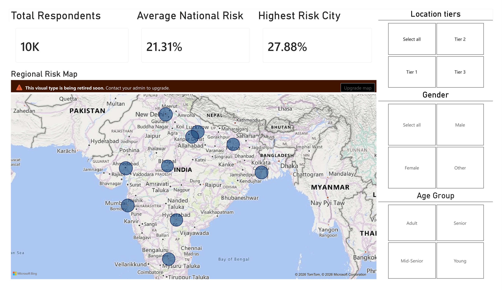
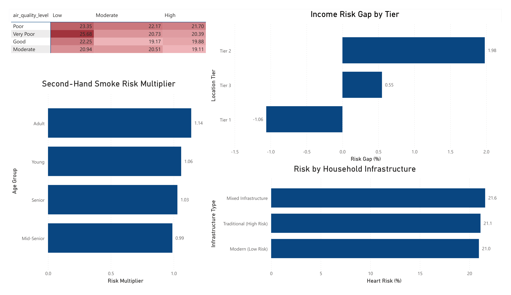
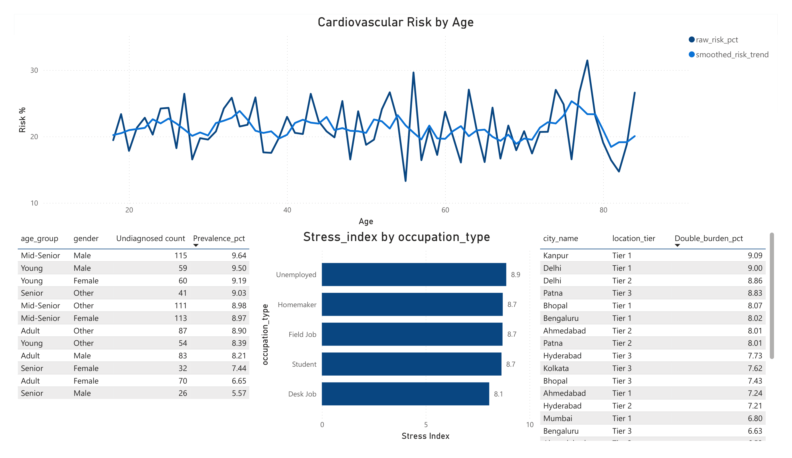

# Cardiovascular Risk Profiling — India

End-to-end analytics project profiling cardiovascular risk across 10,000
survey respondents in India, uncovering how socio-economic status, air
quality, occupation, and lifestyle factors interact to drive heart disease
risk — beyond what basic demographics alone would show.

**Pipeline:** Raw CSV → Python cleaning & feature engineering → MySQL KPI
layer → Power BI executive dashboard

---

## Table of Contents
- [Project Overview](#project-overview)
- [Tech Stack](#tech-stack)
- [Repository Structure](#repository-structure)
- [How to Run This Project](#how-to-run-this-project)
- [Key Findings](#key-findings)
- [Power BI Dashboard](#power-bi-dashboard)
- [Data Dictionary](#data-dictionary)
- [License](#license)

---

## Project Overview

**Situation:** Healthcare stakeholders often analyze health data using basic
demographics alone, missing the deeper socio-economic, environmental, and
behavioral drivers of disease. This project started from a raw, messy survey
dataset — missing values, inconsistent text formatting, BOM encoding issues,
and no calculated risk metrics — covering 10,000 respondents across
10 Indian cities.

**Objective:** Take the dataset through a full analytics lifecycle:
1. **Clean & engineer** the raw data in Python
2. **Model & query** it in MySQL to answer 10 specialized KPIs
3. **Visualize** the results in an executive-ready Power BI dashboard

**Result:** A fully audited, zero-null dataset with engineered risk features,
10 SQL-backed KPI views uncovering regional hotspots, socio-economic risk
gaps, and a data-driven "critical screening age" — see [Key Findings](#key-findings)
for the full breakdown.

---

## Tech Stack

| Layer | Tool |
|---|---|
| Data cleaning & feature engineering | Python (pandas, numpy) |
| Exploratory analysis & visualization | matplotlib, seaborn, Jupyter |
| Database & KPI logic | MySQL (CTEs, window functions, views) |
| Executive dashboard | Power BI *(planned — see roadmap)* |

---

## Repository Structure

```
.
├── data/
│   ├── raw/                          # Original, unmodified survey export
│   │   └── indian_heart_health_survey_10k.csv
│   └── processed/                    # Cleaned, feature-engineered dataset
│       └── heart_health_FINAL_CLEANED.csv
├── notebooks/
│   └── Exploratory_Data_Analysis.ipynb   # Cleaning, feature engineering, EDA charts
├── sql/
│   ├── schema.sql                    # CREATE TABLE + data load
│   ├── queries/                      # 10 KPI view definitions (01-10)
│   └── query_soln/                   # Query outputs as CSV (KPI1-10)
├── docs/
│   ├── data_dictionary.md            # Every column, raw and engineered
│   ├── insights_summary.md           # Findings write-up per KPI
│   └── powerbi_roadmap.md            # Dashboard build plan (not yet built)
├── requirements.txt
├── LICENSE
└── README.md
```

---

## How to Run This Project

### 1. Environment setup
```bash
pip install -r requirements.txt
```

### 2. Run the EDA & cleaning notebook
```bash
jupyter notebook notebooks/Exploratory_Data_Analysis.ipynb
```
This reads `data/raw/indian_heart_health_survey_10k.csv`, cleans it, engineers
`income_rank`, `high_risk_flag`, and `age_group`, walks through 8 exploratory
charts, and re-exports the result to `data/processed/heart_health_FINAL_CLEANED.csv`.

### 3. Load into MySQL
```bash
mysql -u <user> -p --local-infile=1 < sql/schema.sql
```
> Requires `local_infile=1` enabled on both the client and server side for
> the `LOAD DATA LOCAL INFILE` step. See comments in `sql/schema.sql` if you
> hit the BOM/encoding issue mentioned there.

### 4. Run the KPI queries
Execute the view definitions in `sql/queries/01_query.sql` through
`10_query.sql` against the `heart_health_project` table. Each corresponds to
a CSV of the same result already saved in `sql/query_soln/` for reference.

### 5. Power BI
Import the 10 KPI CSVs from `sql/query_soln/` into Power BI Desktop and build
the dashboard per the structure in [`docs/powerbi_roadmap.md`](docs/powerbi_roadmap.md).

---

## Key Findings

Full write-up in [`docs/insights_summary.md`](docs/insights_summary.md).
Highlights:

- **Ahmedabad (Tier 2)** has the highest cardiovascular risk prevalence at
  27.88% — 6.6 points above the national average.
- Very Poor air quality **combined with** low exercise produces the single
  highest-risk segment (25.68%) — worse than either factor alone.
- The "wealth protects health" assumption doesn't hold uniformly: in Tier 1
  cities, higher income respondents show *slightly higher* risk than lower
  income ones.
- 25 city/tier combinations show a "double burden" of low income and very
  poor air quality affecting over 10% of their population simultaneously.
- The smoothed 5-year rolling risk trend points to the early-to-mid 70s age
  bracket as the clearest inflection point for intensified screening —
  rather than a single fixed screening age.

---

## Power BI Dashboard

**Status: Live.** 3-page executive dashboard built on the 10 KPI views.

   ### Page 1 — National Overview
   
   
  Total respondents, average national risk, highest risk city, and a regional risk map of India with tier/gender/age-group slicers.
  
   ### Page 2 — Risk Drivers
   
   
   Air quality × exercise risk matrix, income risk gap by tier, second-hand smoke risk multiplier by age group, and risk by household infrastructure.


   ### Page 3 — Screening & Equity
   

   Cardiovascular risk by age (raw vs. smoothed trend), undiagnosed symptom prevalence by age/gender, occupational stress index, and double burden hotspot cities.

---

## Data Dictionary

Full column-by-column reference (raw + engineered fields, with cleaning notes)
is in [`docs/data_dictionary.md`](docs/data_dictionary.md).

---

## License

This project is licensed under the [MIT License](LICENSE).
